<!-- HEADINGS -->

# 
**INSTITUTO TECNOLÓGICO SUPERIOR DE CHICONTEPEC**

# 

## 
*INGENIERÍA EN SISTEMAS COMPUTACIONALES*

### 
**Materia:**

### 
Ecuaciones Diferenciales

### 
**Manual de Instalación y Configuración**

### 
**Nombre del estudiante:**

### 
Isabel Arely Cruz Olivares

### 
**Nombre del docente:**

### 
Said Jair Guerra Escudero

### ÍNDICE 
* Descarga del programa Python 
* Instalación de Python 
* Configuración de las variables de entorno 

### 1. Descarga del programa Python 
#### En el buscador de Google escribir Python y seleccionar la primera página que muestra.
# 

#### Se muestra la siguiente página y dar clic en la pestaña Downloads.
# 
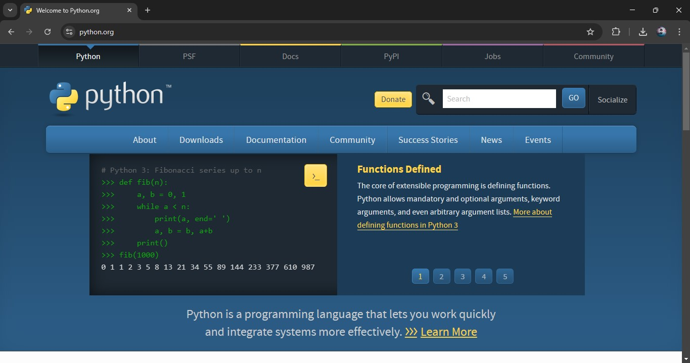

#### Una vez estando en la pestaña Downloads, dar clic en Python 3.13.1.
# 
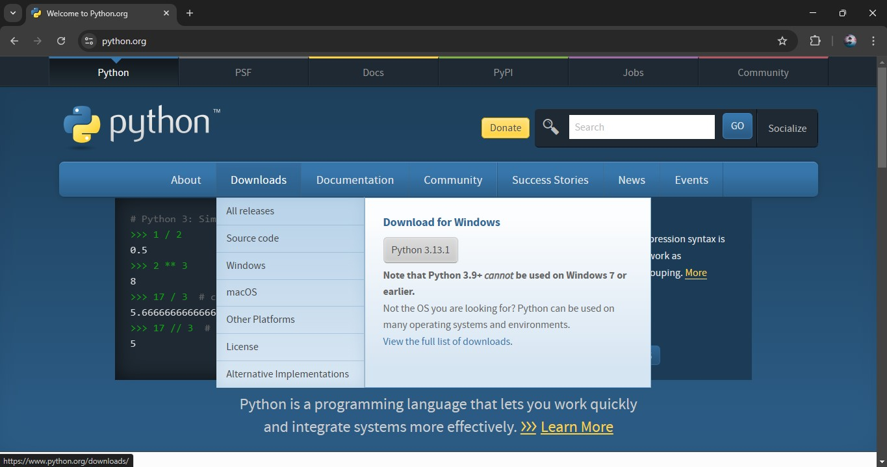

#### Y comienza la descarga.
# 
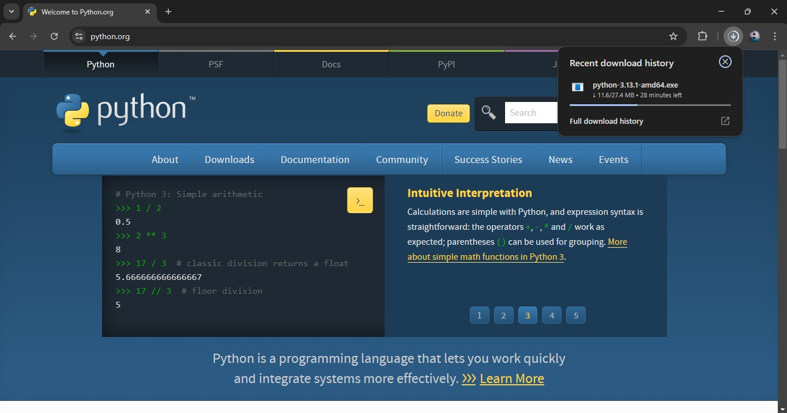

#### La descarga se a completado.
# 
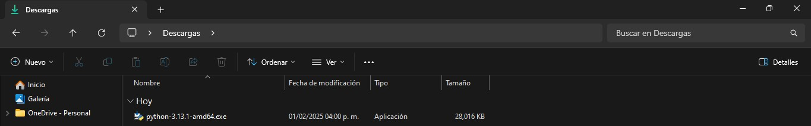

### 2. Instalación de Python en la unidad C 
#### Activar las dos últimas casillas “Use admin privileges when installing py.exe y Add Python.exe to PATH.
# 
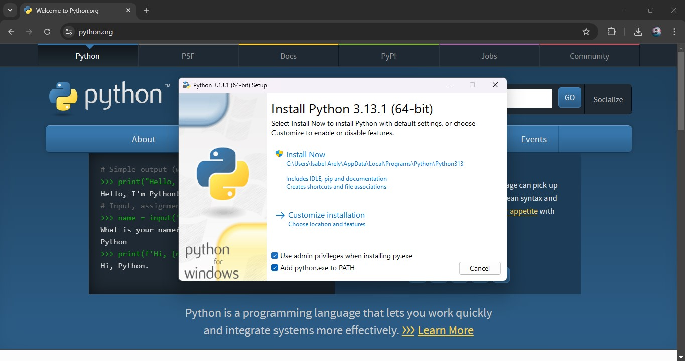

#### Luego seleccionar Customize Installation.
# 
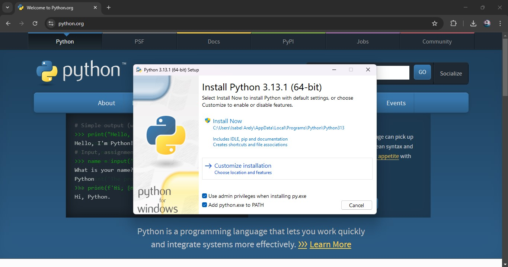

#### Activar todas las casillas que se muestran y dar clic en Next.
# 
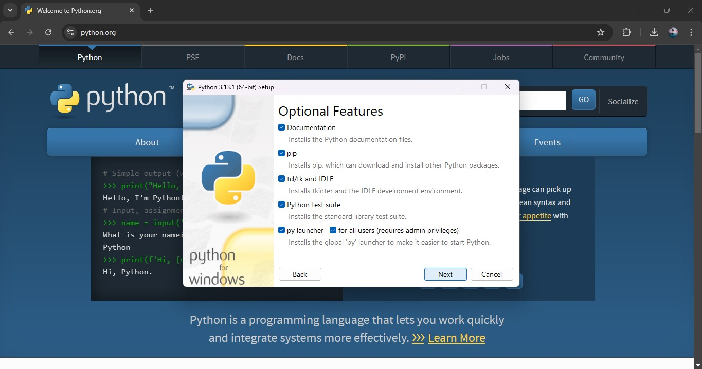

#### Después se muestra lo siguiente y activar las tres casillas Associate files with Python (requires the ´py´ launcher), Create shortcuts for installed applications, Add Python to environment variables y seleccionar Browse.
# 
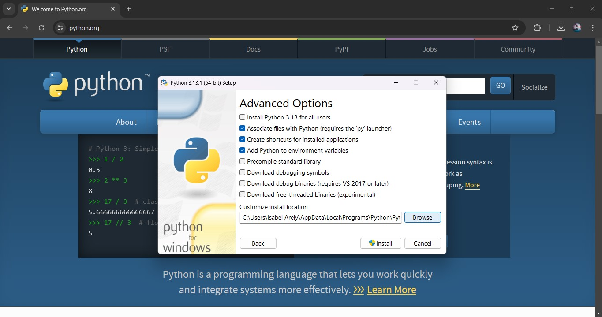

#### Seleccionar Este equipo.
# 

#### Seleccionar Windows (C:) y dar clic en Install.
# 
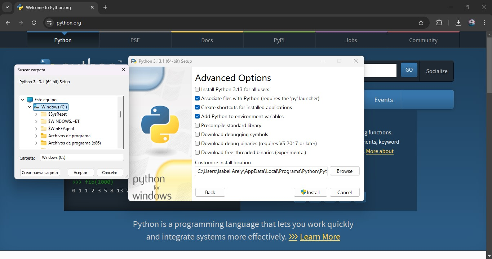

#### Comienza la instalación de Python.
# 
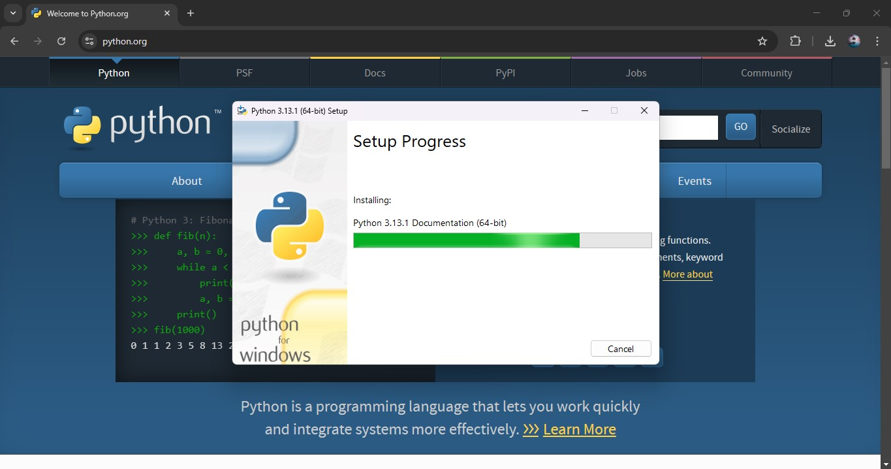

#### Finalmente dar clic en Close.
# 
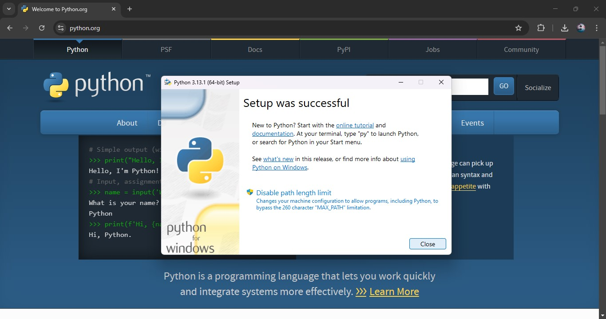

### 3. Configuración de las variables de entorno 
#### Para configurar las variables de entorno, ir a Windows (C:).
# 
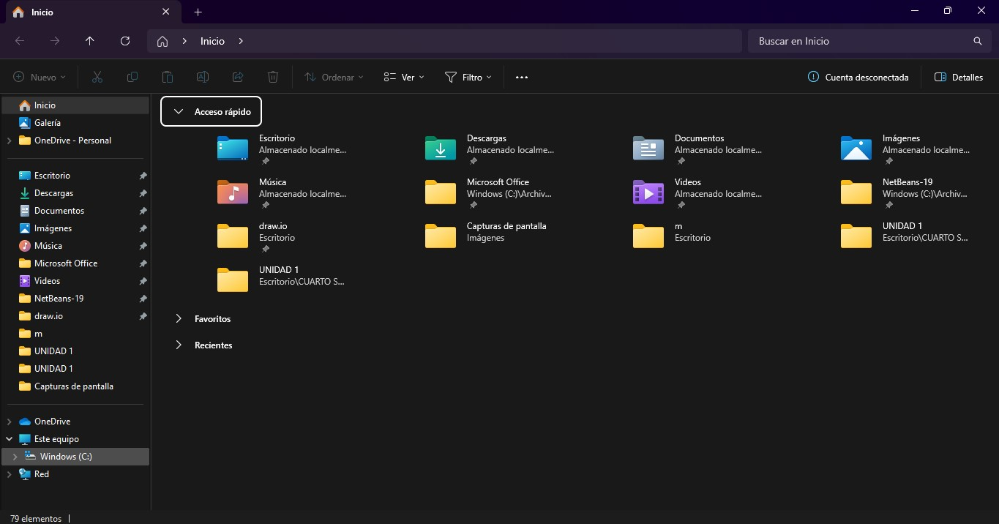

#### Luego seleccionar Configuración avanzada del sistema.
# 
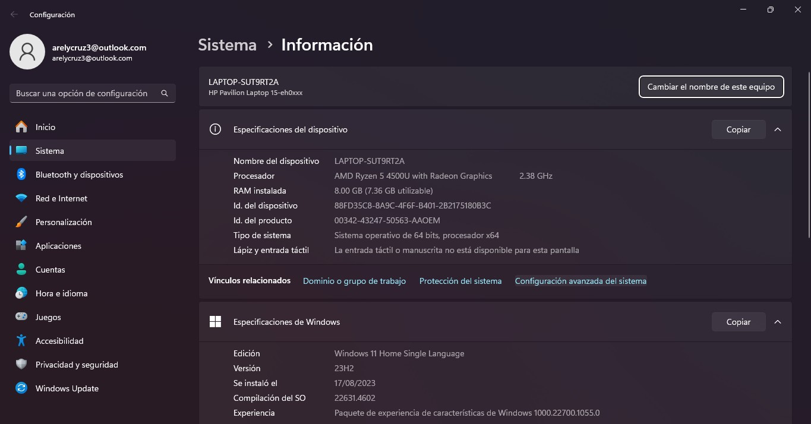

#### En Propiedades del sistema, seleccionar Variables de entorno.
# 
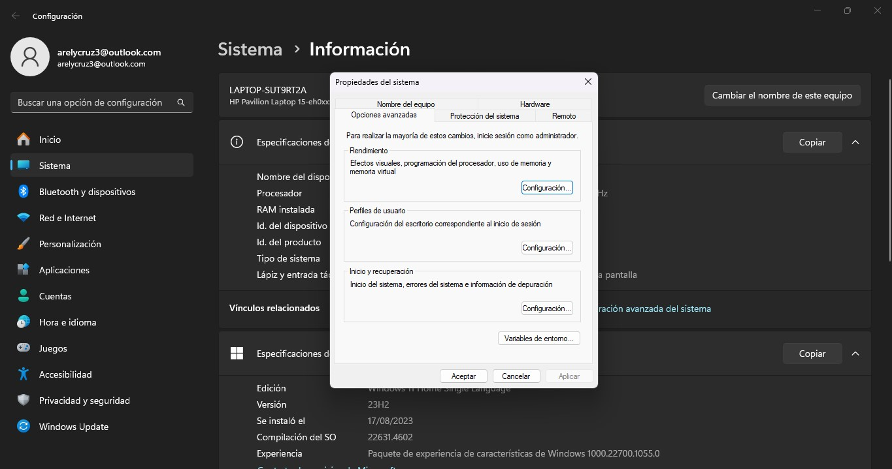

#### Dar clic en Path y clic en Editar.
# 
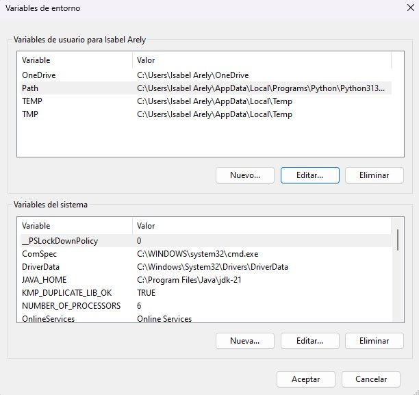

#### Luego clic en Aceptar.
# 
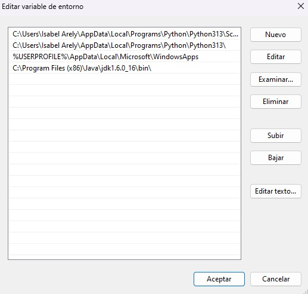

#### Nuevamente dar clic en Aceptar.
# 
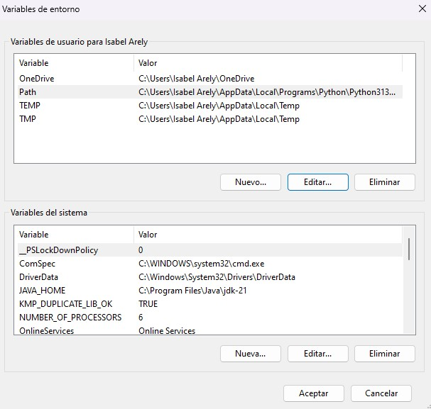

#### Finalmente dar clic en Aceptar.
# 
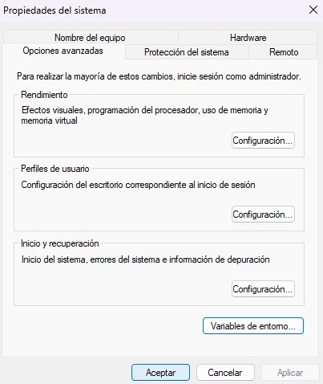

<!-- GITHUB MARKDOWN -->
* [x] Task 1
